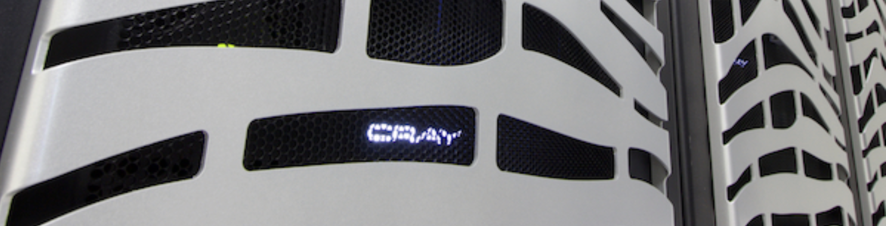

# Course Description
The purpose of this 2-day workshop is to teach participants how to use the new parallel capabilities in MODFLOW.  The course will provide an overview of the MODFLOW 6 program, the Python tools available for pre- and post-processing simulations, and the concepts for parallel computing with MODFLOW.  The course will include hands-on exercises that progress from serial simulations on laptops to parallel simulations on Denali.  

# Getting Started

Windows Subsystem for Linux (WSL) is a straight forward way for Windows users to get started using the parallel version of MODFLOW. Instructions for setting up WSL and compiling the parallel version of MODFLOW is provided in [wsl_setup.md](./wsl_setup.md).

If you are using the MacOS or Linux operating system you can follow the instructions in [wsl_setup.md](./wsl_setup.md) starting at the [Installing_Miniconda section](./wsl_setup.md#installing-miniconda). 

# Agenda

## Day 1

```
Welcome and Introductions (30 mins)
Overview of MODFLOW 6 (15 mins)
Overview of parallel processing (15 mins)
FloPy for pre and post processing (30 mins)
BREAK
Hands-on exercise: FloPy and MODFLOW 6 (1 hr 45 mins)
LUNCH 
Hands-on exercise: multi-model coupling (1 hr 30 mins)
BREAK
Presentation: Parallel computing with MODFLOW (60 mins)
Presentation/Demonstration: Getting started on USGS supercomputers (1 hr 15 mins)
```

## Day 2

```
Parallel computing with MODFLOW: model partitioning and load balancing (30 mins)
Hands on exercise: Using FloPy to partition a model (1 hr)
BREAK
Running parallel MODFLOW models on Denali (15 mins)
Hands on exercise: running parallel MODFLOW (1 hr 30 mins)
LUNCH 
Hands on exercise: evaluating parallel performance (1 hr 15 mins)
BREAK
Hands on exercise: Transient simulation (1 hr)
Discussion and Wrap up (30 mins)
```